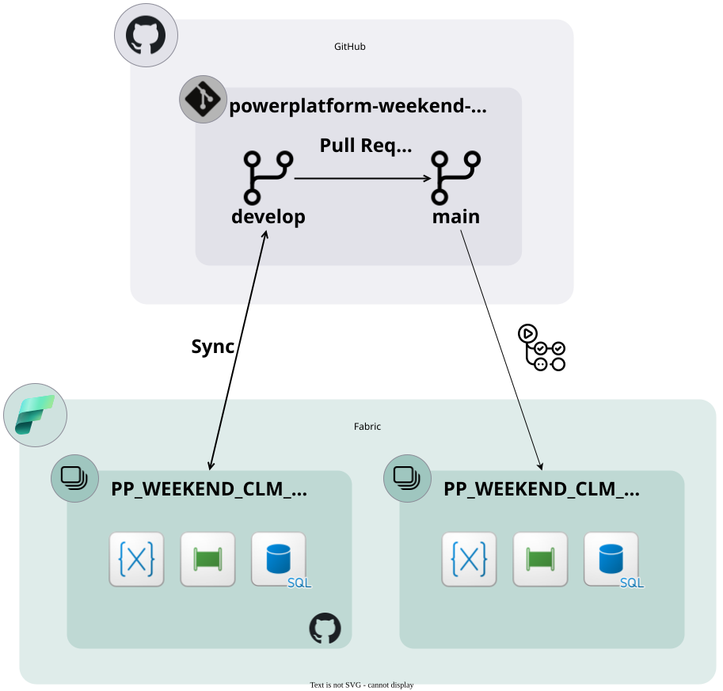
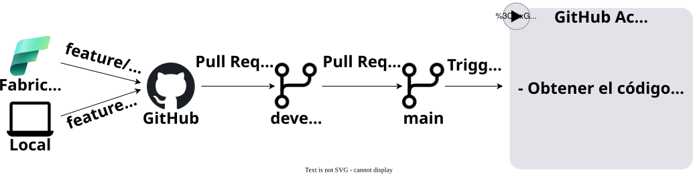

# 1º Power Platform Weekend CLM Caudete (Albacete) 🚀

Repositorio de la ponencia **"De GitHub a Fabric: ¡despliega sin eslomarte!"**  
**Evento:** 1º Power Platform Weekend CLM Caudete (Albacete)

---

## 📖 Resumen

La propuesta de flujo de despliegue de este repositorio, empleada en la demo de la presentación, se basa en el siguiente escenario:

    

- En Microsoft Fabric, se dispone de al menos dos áreas de trabajo:
    - Un área de trabajo de **desarrollo** donde se combinen los cambios llevados a cabo por los distintos desarrolladores de forma independiente y que se encuentra conectada con la carpeta [src](src) de la rama **develop** del repositorio.
    - Un área de trabajo para **producción** donde las modificaciones, una vez combinados tras la apertura de una solicitud de incorporación de cambios, son publicadas siguiendo el siguiente flujo de acciones

      

          
      

      
---

## 📦 Contenidos

- **/scripts**: Scripts que sirven de apoyo en el proceso de despliegue.
- **/src**: Código fuente de los artefactos de Microsoft Fabric contenidos en el área de trabajo a promocionar.
- **/sql**: Proyecto SQL y scripts de base de datos.
- **/resources**: Recursos adicionales.
- **/doc**: Material utilizado para realizar la presentación.

---

## 🗹 Prerequisitos

El flujo de despliegue de este repositorio emplea:

- Una [entidad de servicio](https://learn.microsoft.com/es-es/entra/identity-platform/app-objects-and-service-principals?tabs=browser) configurada con una [credencial federada](https://learn.microsoft.com/es-es/azure/developer/github/connect-from-azure?tabs=azure-portal%2Cwindows) para confiar en tokens emitidos por Acciones de GitHub desde el repositorio.
- Dicha entidad de servicio necesita:
    - Configurar previamente el inquilino para que las entidades de servicio puedan trabajar con los distintos artefactos de Fabric empleados en el desarrollo.
    - Si el área de trabajo de producción no está creada, ser al menos colaborador sobre la capacidad sobre la que se deba crear.
    - Si aplica, como es el caso de la demo, disponer de permisos sobre la conexión al origen de datos.

---

## 📃 Instrucciones de uso

1. Revisar los prerequisitos del punto anterior.
2. Bifurcar este repositorio.
3. Configurar los siguientes secretos y variables en el repositorio:
    | Nombre            | Tipo   | Valor                |
    |-------------------|--------|----------------------|
    | `CLIENT_ID`       | Secreto | Identificador de la entidad de servicio   |
    | `TENANT_ID` | Secreto | Identificador del inquilino |
    | `SUBSCRIPTION_ID` | Secreto | Identificador de la suscripción de Azure donde se encuentra la capacidad empleada |
    | `FABRIC_ADMIN_UPNS` | Secreto | Identificadores de los usuarios a añadir como administradores en el área de trabajo de producción |
    | `FABRIC_CAPACITY` | Secreto | Nombre de la capacidad a emplear donde desplegar los artefactos de Fabric |
    | `WORKSPACE_NAME` | Variable | Raíz del nombre del ára de trabajo a utilizar tanto en desarrollo como producción |
    | `SQL_DATABASE_NAME` | Variable | Nombre de la base de datos SQL en Fabric |
    | `ORCHESTRATOR_NAME` | Variable | Nombre de la canalización que gestiona la carga de datos de la solución |

4. Ejecutar la acción existente en el repositorio, ya sea manualmente o desencadenando una nueva incorporación de cambios.